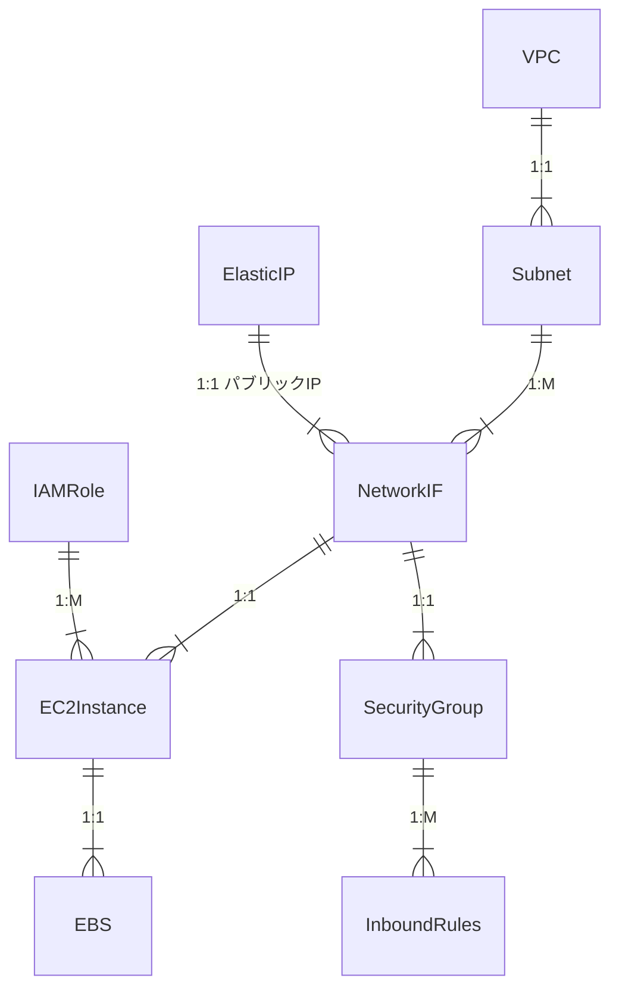

# TEMPLATE-EC2

## 概要

EC2 インスタンスを作成するためのテンプレート

## 成果物

下記の構成を生成できる



## 使い方

### 前提

- terraform がインストールされていること
- docker がインストールされていること
- aws cli がインストールされていること
  - aws configure で認証情報を設定していること
  - プロファイル名は localstack で、アクセスキーとシークレットキーはダミーで OK

```profile
$ aws configure --profile localstack

> AWS Access Key ID [None]: dummy
> AWS Secret Key [None]: dummy
> Default region name [None]: ap-northeast-1
> Default output format [None]: json

```

### 使い方

1. `docker-compose up -d` で localstack を起動する
2. `terraform init` で初期化する
3. `terraform plan` でプランを確認する
4. `terraform apply` でリソースを作成する

## オプショナル

### awslocal

aws cli の代わりに awslocal を使うと、localstack に対して aws cli のコマンドを楽に実行できる

- endpoint-url を都度記載する必要がなくなる

```bash
aws --endpoint-url=http://localhost:4566 kinesis list-streams
# awslocal でも同じ
awslocal kinesis list-streams
```
