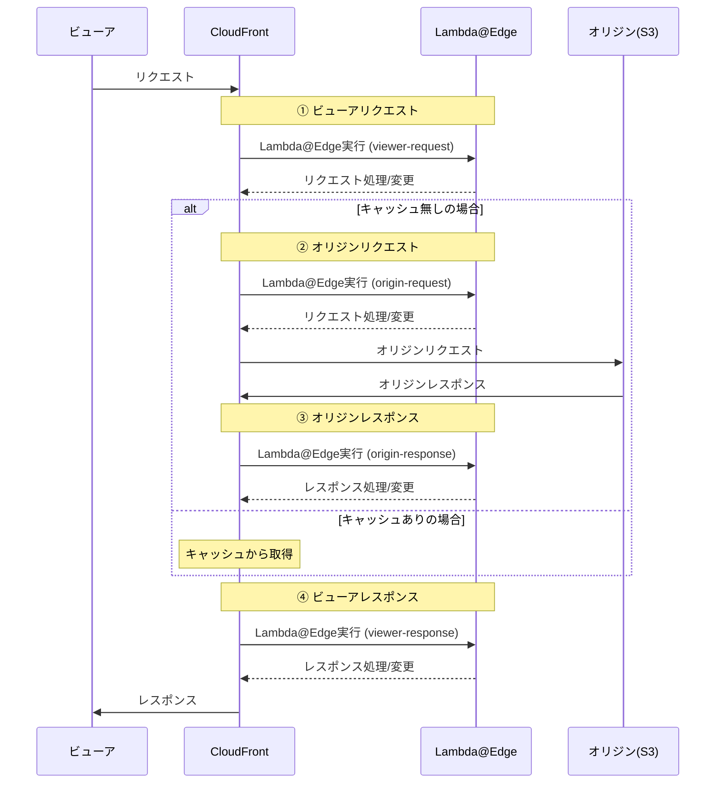

API-GW では 10MB までのペイロード制限があり、大容量ファイルをフロントエンドで DL できない問題がある。
CloudFront の Lambda@Edge を利用して、JWT 認証を行い、大容量ファイルを配信できる構成にする。

# 構成図


API スタック

- API Gateway（JWT 発行用）
- Lambda（API ログイン処理）
- Cognito User Pool（ユーザ管理用）

配信スタック

- CloudFront ディストリビューション
- S3 バケット（大容量ファイル格納用）
- Lambda@Edge（JWT 認証用）
  - リージョン `us-east-1` 必須

# CloudFront のポイント

- オリジンに S3 バケットを指定
- OAC (Origin Access Control) を設定して、CloudFront からのみ S3 にアクセス可能にする
- Lambda@Edge の紐づけは、event type: `Viewer Request` を指定する

## event type

CloudFront におけるイベントタイプは、Lambda@Edge を実行するタイミングを指定できる
API-GW のリクエスト、統合リクエスト、統合レスポンス、レスポンスみたいなイメージ
（認証失敗時って早期リターンできるのかな？）

| イベントタイプ     | 説明                                                 |
| ------------------ | ---------------------------------------------------- |
| ビューアリクエスト | リクエストがオリジンに転送される前処理を制御できる。 |
| オリジンリクエスト | オリジンに転送されるリクエストを変更できる。         |
| オリジンレスポンス | オリジンからのレスポンスを変更できる。               |
| ビューアレスポンス | レスポンスヘッダの追加や変更ができる。               |



> Lambda@Edge 関数をトリガーできる CloudFront イベント
> https://docs.aws.amazon.com/ja_jp/AmazonCloudFront/latest/DeveloperGuide/lambda-cloudfront-trigger-events.html

# Lambda@Edge のポイント

- リージョン `us-east-1` にデプロイする必要がある
- JWT の検証には `amazon-cognito-identity-js` or `aws-jwt-verify` ライブラリを利用することを推奨
- 制約事項あり
  - 環境変数の使用不可
    - SSM パラメータストアならいけるかも？
  - パッケージサイズ
    - Viewer Request: 1MB 制限
    - Origin Request: 3MB 制限
  - タイムアウト
    - Viewer Request：max 5 秒
    - Origin Request：max 30 秒

## Cognito ID トークンについて

ID トークンは下記の情報をエンコードしている。

- ヘッダ
  - alg: 署名アルゴリズム
  - kid: 鍵 ID
- 主なペイロード
  - iss: 発行者
  - sub: ユーザ識別子
  - aud: クライアント ID
  - exp: 有効期限
  - iat: 発行時間
  - email: ユーザメールアドレス
  - email_verified: メールアドレス検証済みフラグ

https://openid.net/specs/openid-connect-core-1_0.html#StandardClaims

## ID トークンの検証ポイント

`aws-jwt-verify` ライブラリを利用する場合、下記だけで OK

```javascript
import { CognitoJwtVerifier } from "aws-jwt-verify";

// ポイント1 : 自前Cognitoユーザプールの情報を指定
// Cognito User Pool 用の JWT 検証器を作成
// tokenUseとは、検証するトークンの種類を指定 ("id" or "access")らしい
const verifier = CognitoJwtVerifier.create({
  userPoolId: "your USER_POOL_ID",
  clientId: "your CLIENT_ID",
  tokenUse: "id",
});

exports.handler = async (event) => {
  const request = getRequest(event); // いい感じにeventからリクエストを取得
  const authHeader = request.headers["authorization"]?.[0]?.value;

  // ポイント2 : Authorization ヘッダの Bearer プレフィックスは除去
  const token = authHeader.replace("Bearer ", "");

  try {
    // ポイント3 : verify メソッドで署名とクレームを検証
    const payload = await verifier.verify(token);
    console.log("Token is valid. Payload:", payload);
    return request;
  } catch (err) {
    console.log("Token verification failed:", err);
    return {
      status: "401",
      statusDescription: "Unauthorized",
    };
  }
};
```

https://docs.aws.amazon.com/ja_jp/cognito/latest/developerguide/amazon-cognito-user-pools-using-tokens-verifying-a-jwt.html

## ID トークンを素の Cognito エンドポイントで検証する場合

1. リクエストの JWT ヘッダーから kid (Key ID)を取得
2. 自前の Cognito ユーザプールに問い合わせて公開鍵を取得
   - `https://cognito-idp.{region}.amazonaws.com/{userPoolId}/.well-known/jwks.json`
3. 手順 1 で取得した kid に対応する公開鍵で RS256 署名を検証
4.

```javascript
import * as jwt from "jsonwebtoken";
import axios from "axios";

exports.handler = async (event) => {
  const request = getRequest(event); // いい感じにeventからリクエストを取得
  const authHeader = request.headers["authorization"]?.[0]?.value;
  const token = authHeader.replace("Bearer ", "");

  try {
    // ポイント1 : JWTヘッダーからkid (Key ID)を取得
    const decodedHeader = jwt.decode(token, { complete: true });
    const kid = decodedHeader.header.kid;

    // ポイント2 : Cognito公開鍵をダウンロード
    const jwksUrl = `https://cognito-idp.${process.env.AWS_REGION}.amazonaws.com/${process.env.USER_POOL_ID}/.well-known/jwks.json`;
    const response = await axios.get(jwksUrl);
    const jwks = response.data;

    // ポイント3 : kidに対応する公開鍵でRS256署名を検証
    const publicKey = getPublicKeyFromJwks(jwks, kid);
    jwt.verify(token, publicKey, { algorithms: ["RS256"] });

    // ポイント4 : クレームの検証 (例: exp, aud)
    // 発行日時(exp)やクライアントID(aud)の検証を追加実装することを推奨
    // 割愛
    // --------------------------------------------------------------------

    console.log("Token is valid.");
    return request;
  } catch (err) {
    console.log("Token verification failed:", err);
    return {
      status: "401",
      statusDescription: "Unauthorized",
    };
  }
};

function getPublicKeyFromJwks(jwks, kid) {
  const key = jwks.keys.find((key) => key.kid === kid);
  if (!key) {
    throw new Error("Public key not found in JWKS");
  }
  // JWKSからPEM形式の公開鍵を生成する処理を実装
  // 割愛
  return convertJwkToPem(key);
}
```
