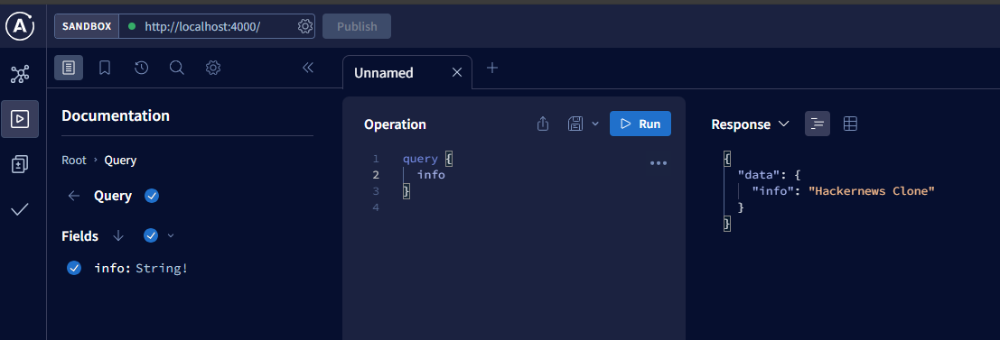

# お勉強メモ

## GraphQL 入門

### GraphQL とは

- Facebook が開発した API のクエリ言語

### REST API との違い

|                | GraphQL      | REST API       |
| -------------- | ------------ | -------------- |
| たたき方       | 問い合わせ文 | URL + メソッド |
| エンドポイント | 1 つに集約   | 複数           |

### Apollo Server/Client とは

- GraphQL の実装を提供するライブラリ

## 環境構築

```package.json
  "dependencies": {
    "@apollo/client": "^3.8.5",
    "@apollo/server": "^4.9.4",
    "graphql": "^16.8.1"
  }
```

## GraphQL サーバーの実装

### 用語

- スキーマ
  - GraphQL で定義する型のこと
  - `tyepDef` で定義する
- Query
  - GraphQL のタイプのひとつ
  - 予約語（らしい）
  - `typeDef` 内で定義する
- リゾルバ
  - スキーマに定義した型の値を返す関数のこと
  - クラスとインスタンスの関係に近そう
  - `resolvers` で定義する

## Server の起動

詳細は下記のファイル

> ./src/index.ts

`npm run start` を実行すると `localhost:4000` でサーバーが起動する

- 起動すると GraphQL の IDE （プレーグラウンド）が起動する

### Playground の使い方

GraphQL 版の Postman みたいなもの

- エディタのタブにスキーマを書いて、実行すると結果(右側)が表示される



リクエスト例

```graphql
query ExampleQuery {
  info
  feed {
    description
    id
    url
  }
}
```

レスポンス例

```json
{
  "data": {
    "info": "Hackernews Clone",
    "feed": [
      {
        "description": "tutorial for GraphQL",
        "id": "link-0",
        "url": "www.udemy.graphql.com"
      }
    ]
  }
}
```

## GrapQL の CRUD

|      | SQL    | GraphQL  |
| ---- | ------ | -------- |
| 取得 | SELECT | Query    |
| 登録 | INSERT | Mutation |
| 更新 | UPDATE | Mutation |
| 削除 | DELETE | Mutation |

### mutation の実装

```graphql
mutation {
  post(url: "google.com", description: "description") {
    id
    description
    url
  }
}
```

```json
{
  "data": {
    "post": {
      "id": "link-2",
      "description": "description",
      "url": "google.com"
    }
  }
}
```

## Prisma

### なんぞや？

DB 操作に使う ORM（SQL わからなくても DB 操作できるよってやつ）
node.js には統一的な ORM がないので、Prisma を使うと DB の操作を統一的に行える

### インストール

```bash
npm install prisma -D
npm install @prisma/client

npx prisma init
```

`prisma init`すると、`prisma`ディレクトリと下記ファイルが自動作成される

```prisma
// This is your Prisma schema file,
// learn more about it in the docs: https://pris.ly/d/prisma-schema

generator client {
  provider = "prisma-client-js"
}

datasource db {
  provider = "sqlite"
  url      = env("DATABASE_URL")
}
```

### migration

model を定義したらマイグレーションする
上手く実行できると SQL 文が生成される

```bash
npx prisma migrate dev
```

### Prisma Client

```bash
npx prisma generate
```

### PrismaStudio

DB の中身を確認できる GUI ツール

```bash
npx prisma studio
```
